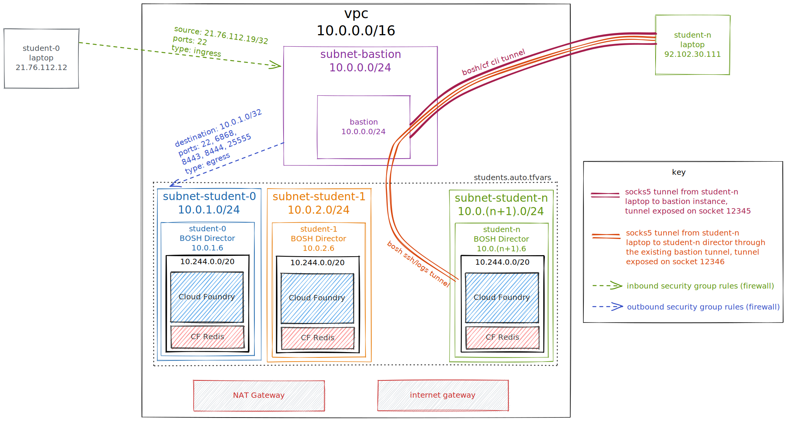

# BOSH Training Infra

Welcome!! This repository contains the resources and pipeline for setting up the training infrastructure and environments for students to participate in the BOSH Training.

# Architecture



## Adding a student

To add a student you'll need to add the following entry into the students list stored within the [student.auto.tfvars](./students.auto.tfvars) file.

```
students = [
  {
    name = "test_user1"
    ips = ["127.0.0.1", "255.255.255.0"]
    subnet_cidr = "10.0.1.0/24"
  },
+ {
+   name = "test_user2"
+   ips = [<HOME_IP_ADDRESS>, <OFFICE_IP_ADDRESS>]
+   subnet_cidr = "10.0.2.0/24"  <---- Increment the third octet since we're using /24
+ }
]
```

## Accessing the BOSH Training Environment

Each student listed in [students file](./students.auto.tfvars) should have an archive within the [eb-bosh-training-infra](s3://eb-bosh-training-infra/student-packs/) bucket. The link for a student should be as follows `https://eb-bosh-training-infra.s3.eu-west-2.amazonaws.com/student-packs/<student-name>.tgz`.

Once downloaded, each student would need to:

```commandLine
#### decompress and unarchive the file ####
$ tar zxvf <student-name>.tgz

#### ensure all env variables are set in your shell environment ####
$ eval "$(cat linux_env_filename)"

#### test student credentials work ####
$ bosh login
Successfully authenticated with UAA
```